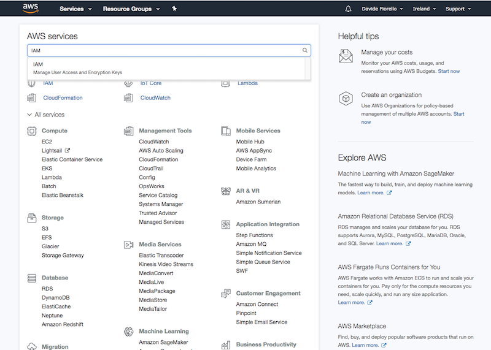
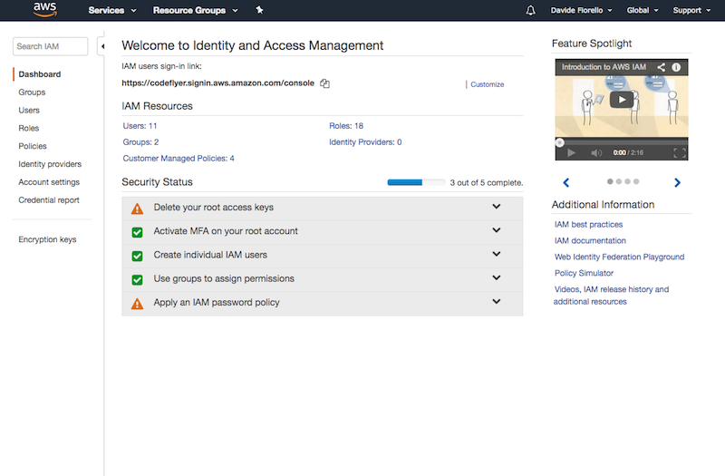
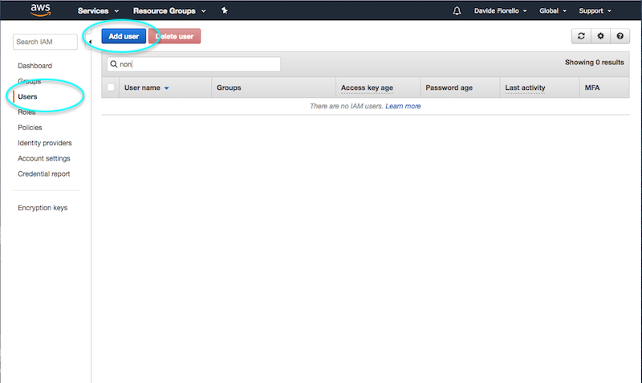
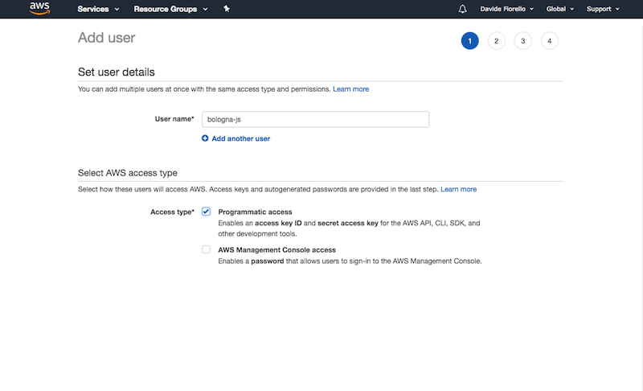
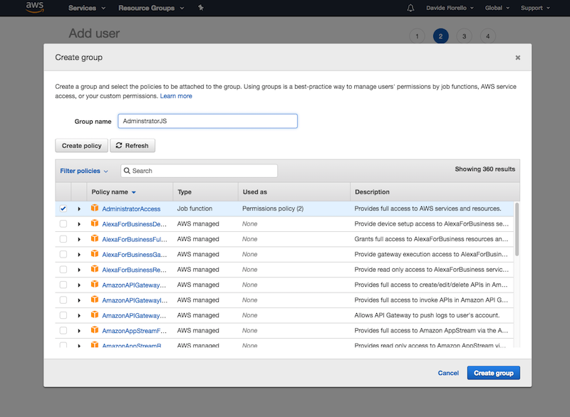
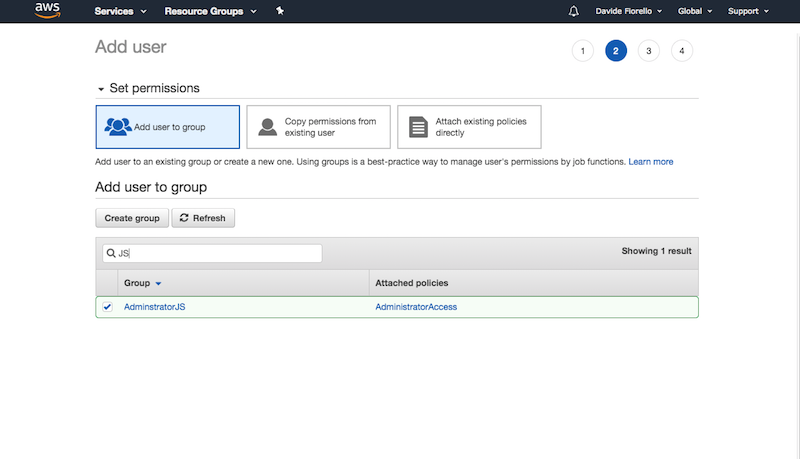
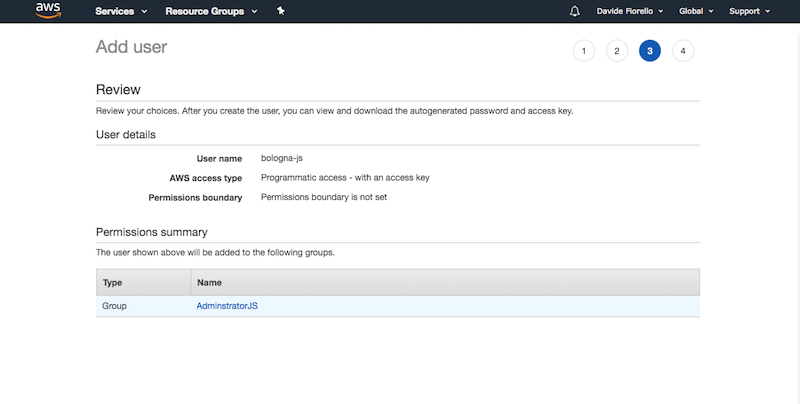

# Serverless Workshop

## Configure AWS

Create an account in AWS [http://aws.amazon.com/]

#### Create a IAM

In the AWS console create a new IAM user with Administrator Access

From the AWS panel create a User called `bologna-js` that has access to the `AdministratorAccess`
(Use this at your own risk and limit acces in a production environment)

***Go to the IAM panel***





***Select the User tab and click "Add a user"***



***Create a user with `bologna-js` name***



***Create a user group with Administrator access***



***Assign the group***



***Copy the credentials (The secret cannot be retrieved)***



#### Add the profile in your `~/.aws/credentials` file

```
[default]
aws_access_key_id = AKDIxxxxxxxxxxxxxxxx
aws_secret_access_key = 6Y4zf4Nxxxxxxxxxxxxxxxxxxxxxxxxxxxxxxxxx

[bologna-js]
aws_access_key_id = AKIAxxxxxxxxxxxxxxxx
aws_secret_access_key=6Y4zf4Nxxxxxxxxxxxxxxxxxxxxxxxxxxxxxxxxx
```

#### Add the region in your `~/.aws/config` file

```
[default]
region = eu-west-1

[profile bologna-js]
region = eu-west-1
```

### Install the app

```
npm install
```


### Deploy

```
npm run deploy
```

You'll receive this output:

```
 serverless deploy

Serverless: Packaging service...
Serverless: Creating Stack...
Serverless: Checking Stack create progress...
.....
Serverless: Stack create finished...
Serverless: Uploading CloudFormation file to S3...
Serverless: Uploading artifacts...
Serverless: Validating template...
Serverless: Updating Stack...
Service Information
service: todo-bologna-js
stage: dev
region: eu-west-1
stack: todo-bologna-js-dev
api keys:
  None
endpoints:
  None
functions:
  None
```

### Remove

```
npm run remove
```
